# NXP Cup Racing Car - Autonomous Vehicle

Autonomous miniature racing car for the NXP Cup. It follows white lane boundaries in real time using a Pixy2 camera, an Ackermann steering model, and dual-wheel velocity control.

**Team:**
- **Ahmed Amine Sebti** - Electronic and mechanical design, PCB and assembly
- **Adem Dali & Aymen Turki** - Vision integration, Ackermann model, velocity regulation, software implementation

**Institution:** INSAT IIA 4

---

## System Architecture


The diagram shows a three-stage flow: perception -> control -> actuation. Pixy2 provides line vectors, IR handles start/finish, and ToF handles obstacle stop. These signals feed a real-time controller on the Teensy 4.1 running at 200 Hz. The controller computes steering and velocity, then drives the servo and DC motor with encoder feedback.

In practice, the architecture is split into two execution contexts:
- A 200 Hz ISR (Timer1) for odometry, PID, and actuation
- A free-running main loop for vision, ToF reads, and UI

This separation ensures deterministic control timing even when vision processing varies in cost.

---

## Vision Pipeline


The Pixy2 performs onboard line tracking and sends line vectors (not raw images) at about 60 fps over SPI (2 MHz). This reduces latency and keeps the MCU focused on control. The vision module performs:

1. **Acquisition** - `pixy.line.getAllFeatures()` reads all vectors in the 72x52 frame.
2. **Filtering** - Angle filter keeps vectors with $\theta$ in $[\text{ANGLE_THRESHOLD}, 180-\text{ANGLE_THRESHOLD}]$. Zone filter keeps vectors whose lower end is in the bottom 90 percent of the frame.
3. **Classification** - Vectors are split by $x_0 < W/2$ into left/right lists and sorted by length (longest = most reliable).
4. **Mode Selection** - `BOTH`, `BOTH_SINGLE`, `LEFT`, `RIGHT`, or `LOST` depending on visibility and merge distance.
5. **Smoothing** - Moving average over the last 15 frames to reduce jitter.

Angle computation and correction:

$$\theta = \operatorname{atan2}(dy, dx) \cdot \frac{180}{\pi}, \quad \theta_{\text{norm}} = (\theta + 180) \bmod 180$$

In `BOTH`, a lateral correction is added and constrained to $[-15, 15]$ degrees based on the center offset. In `BOTH_SINGLE`, the correction is weighted by `K_lateral`.

Decision logic highlights:
- `BOTH`: use midline between left and right vectors
- `BOTH_SINGLE`: fuse close vectors when the lane converges
- `LEFT` or `RIGHT`: follow single visible boundary
- `LOST`: keep a safe straight heading until vectors reappear

Key parameters used in code:
- `ANGLE_THRESHOLD = 15` deg
- `MERGE_THRESHOLD = 10` px
- `SMOOTHING_WINDOW = 15`
- `DEFAULT_SERVO_ANGLE = 87`

---

## Ackermann Steering Model

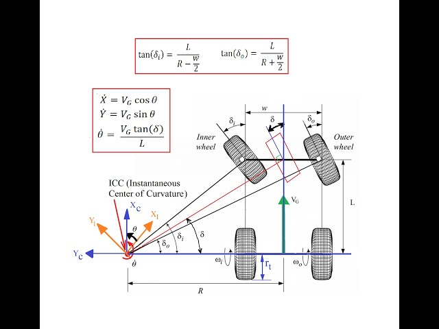

The diagram shows the Ackermann turning geometry. The algorithm converts camera angle error into a physical steering angle so the front wheels follow concentric circles (no lateral slip). From [src/main.cpp](src/main.cpp):

- Error: `e = camera_angle - 87` deg
- Gain switching: `K_STRAIGHT = 2.5`, `K_SHARP = 6.0`, `GAIN_THRESHOLD = 33` deg
- Wheelbase: `WHEEL_BASE_MM = 194`
- Servo limits: `MIN_SERVO_ANGLE = 42`, `MAX_SERVO_ANGLE = 135`

Camera angle is first smoothed with an EMA ($\alpha = 0.7$). The curvature and steering are computed as:

$$\kappa = K_{\text{active}} \cdot e_{\text{rad}}, \quad \delta = \arctan(L \cdot \kappa), \quad \theta_{\text{servo}} = 87 + \delta_{\text{deg}}$$

Result: the front wheels follow concentric turning circles while keeping the vehicle centered. This avoids lateral slip and reduces line loss in tight turns.

---

## Velocity Regulation (Dual PID)



Each wheel has its own PID, and the speed target adapts to steering error. This avoids a differential model and handles mechanical asymmetry.

- **Right wheel:** `Kp=0.25`, `Ki=0.007`
- **Left wheel:** `Kp=0.025`, `Ki=0.007`
- **Velocity profile:** `VELOCITY_PROFILE_MAX_SPEED = 1800` mm/s, `VELOCITY_PROFILE_MIN_SPEED = 1200` mm/s
- **Trapezoidal ramp:** `ACCEL_RATE_MM_S2 = 16000`, `DECEL_RATE_MM_S2 = 24000`

Odometry and filtering:

$$d = \frac{N_{ticks} \cdot \pi \cdot D}{CPR}, \quad v = \frac{d[n] - d[n-1]}{T_e}, \quad v_f[n] = 0.8 v_f[n-1] + 0.2 v[n]$$

PID with antiwindup:

$$u[n] = K_p e[n] + K_i \sum e + K_d (e[n] - e[n-1])$$

Asymmetric gains compensate for higher load on the right wheel. The trapezoidal ramp limits jerk so the motor current and traction remain stable during speed transitions.

---

## Real-Time Control Loop


The report separates execution into a real-time ISR and a free-running main loop. This keeps control deterministic and isolates slower vision and I2C tasks.

**200 Hz timer ISR (5 ms):**
1. `VelOdomRoutine()` - Read encoders, compute velocities
2. `ComputeAngleBasedSpeed()` - Convert steering error to target speed and ramp
3. `VelControllerRoutine()` - Run wheel PID controllers
4. `RotateMotors()` + `SetServoAngle()` - Apply motor PWM and Ackermann command
5. `ReadIRSensors()` / ToF stop checks

The main loop runs the vision pipeline and the HMI updates.

Timing summary:
- $T_e = 5\,ms$ sampling period
- Control runtime well below 500 microseconds per cycle
- Remaining CPU time reserved for perception and UI

---

## Hardware Overview

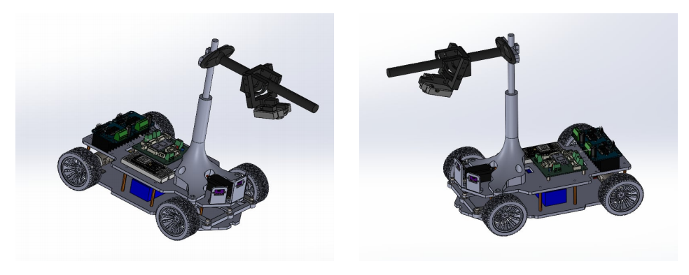

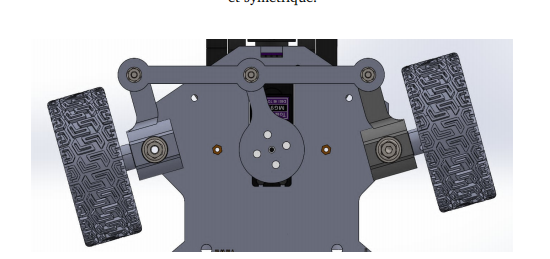

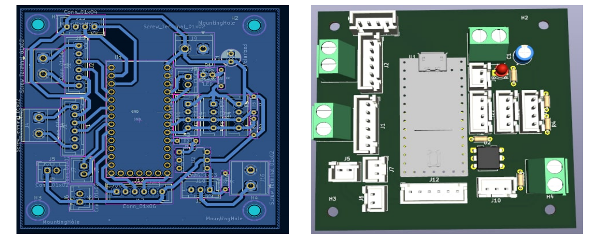

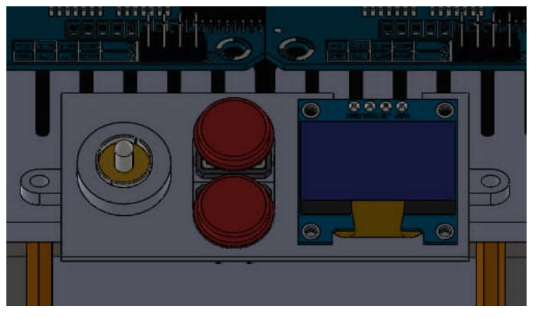

---

## Test Results

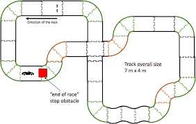

- Stable line tracking through tight curves
- Reliable IR start/finish detection
- ToF obstacle detection below 400 mm
- Consistent lap completion

---

## Demo Video

https://drive.google.com/drive/u/0/folders/1MRDLgWV2qYhkm4TonrECWBcIBtY5L5Ms

---

## Bibliography

1. Mouser Electronics. Mouser Electronics Sponsors NXP Cup 2024. https://www.mouser.com/newsroom/publicrelations-emea-nxp-cup-2024final, 2024. Accessed 2025.
2. NXP Semiconductors. NXP Cup Students Build and Race Autonomous Model Cars. https://www.nxp.com/company/about-nxp/smarter-world-blog/BL-STUDENTS-BUILD-RACE-AUTONOMOUS, 2023. Accessed 2025.
3. NXP Semiconductors. The NXP Cup: More Than a Competition — ASE/Alpha 2024 Champions. https://www.nxp.com.cn/company/about-nxp/smarter-world-blog/BL-NXP-CUP-2024, 2024. Accessed 2025.
4. NXP Semiconductors. NXP Cup Races — Speed Race & Challenges. https://nxpcup.nxp.com/Races, 2025. Accessed 2025.
5. VU Autonomous Systems Engineering Labs. NXP Cup 2024 — ASE/Alpha Team, Hamburg Finals. https://docs.ase.vu.nl/docs/nxp-cup/2024/, 2024. Accessed 2025.

---

**Status:** Fully functional and tested  
**Last Updated:** April 2026
